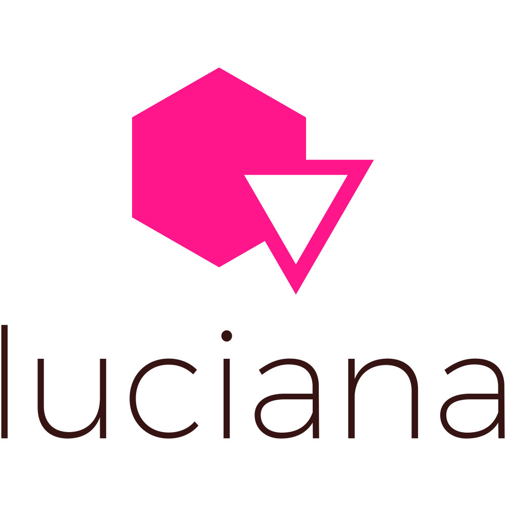

   
  
   
   
  

    Luciana is an Open Source dynamic NodeJS REST API based on the given models and configuration.
  

  

    version 1.0.0-alpha
  

   
  

    <a href="#status"><strong>Status</strong></a> ·
    <a href="#description"><strong>Description</strong></a> ·
    <a href="#guide"><strong>Guide</strong></a> ·
    <a href="#contributing"><strong>Contributing</strong></a>
  

---

## Status

**Luciana** is currently in **alpha** version and not in a production-ready state.

---

## Description

TBC.

---

## Guide

TBC.

---

## Contributing

We welcome community contributions!

Please check out our <a href="https://github.com/PaoloRollo/luciana/issues">open issues</a> to get started.

If you discover something that could potentially impact security, please notify me immediately by sending an e-mail at <a href="mailto:paolo.rollo@cidaro.com">paolo.rollo@cidaro.com</a>. I'll get in touch with you as fast as I can!